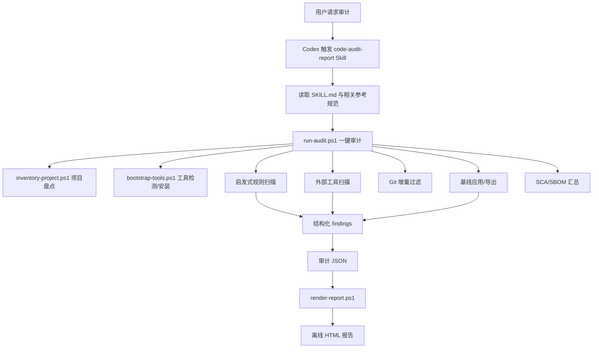
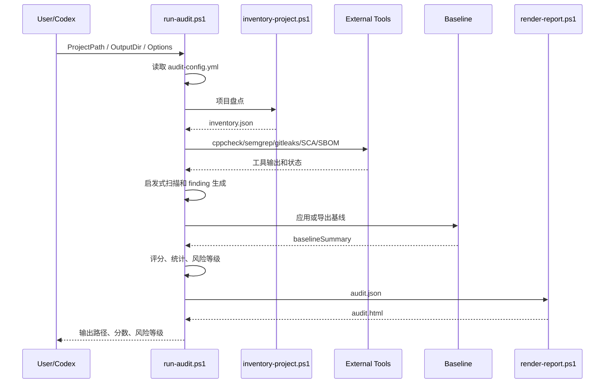

# code-audit-report Skill 详细设计说明

## 1. 文档目的

本文档描述 `code-audit-report` Codex Skill 的详细设计，用于指导后续维护、扩展、评审和交付。本文覆盖系统目标、整体架构、模块划分、核心流程、数据模型、配置机制、报告生成、扩展点、安全设计、测试验证和演进规划。

## 2. 系统定位

`code-audit-report` 是一个面向 Codex 的代码审计 Skill，定位为“代码审计工作流框架 + 工具编排器 + HTML 报告生成器”，而不是完全独立的 SAST 引擎。

系统通过以下方式完成审计：

- 盘点项目源码、依赖清单、构建配置、测试文件、CI 文件和风险面。
- 调用本机已有工具，例如 `cppcheck`、`semgrep`、`gitleaks`、`trivy`、`grype`、`osv-scanner`、`syft`。
- 使用内置启发式规则识别高风险模式。
- 引导 Codex 进行人工复核和补充审计。
- 生成结构化 JSON 审计结果。
- 渲染可离线交付的 HTML 审计报告。

## 3. 设计目标

### 3.1 功能目标

- 支持多语言代码审计，包括 Java、C++、C#、Shell、Kotlin、BAT/CMD、Blazor、XAML/WPF、CSS、Lua、PHP、Python、Go、JavaScript/TypeScript、SQL 和配置文件。
- 覆盖架构合理性、功能正确性、编码规范性、安全性、可靠性、可维护性、性能与资源、可观测性、测试质量、供应链风险等维度。
- 支持全量审计和 Git 增量审计。
- 支持误报、风险接受、已修复等基线状态管理。
- 支持 SCA 供应链审计和 SBOM 生成。
- 支持 CI 门禁，包括高危阻断和最低分阈值。
- 支持报告脱敏，适配外部交付。
- 支持导入外部 SARIF、Semgrep、Gitleaks 等工具结果。

### 3.2 非功能目标

- 证据优先：所有问题都应有源码、配置、依赖、工具输出或设计资料证据。
- 可追踪：保留工具命令、版本、状态、耗时和输出路径。
- 可复审：每条问题保留稳定 `fingerprint`，支持基线比对。
- 可扩展：语言规范、规则、报告结构和外部工具可逐步扩展。
- 离线交付：HTML 报告不依赖外部网络资源。
- 兼容 Windows：当前主执行脚本为 PowerShell，适配 Windows 工作站和 Codex 桌面环境。

## 4. 总体架构



## 5. 目录结构设计

```text
code-audit-report/
  SKILL.md                     # Skill 入口说明和 Codex 使用规则
  README.md                    # 用户说明、安装、命令示例
  audit-config.yml             # 默认审计配置
  assets/
    report-template.html       # HTML 报告模板和前端交互脚本
  custom-rules/
    README.md                  # 团队自定义规则放置说明
  references/
    detailed-design.md         # 本详细设计说明
    audit-workflow.md          # 审计 SOP
    scoring-rubric.md          # 评分规则
    security-checklist.md      # 安全审计清单
    report-schema.md           # 报告 JSON Schema 说明
    false-positive-handling.md # 误报和风险接受规范
    language-*.md              # 语言规范参考
  rules/
    *.json                     # 结构化规则包
  sca/
    README.md                  # SCA/SBOM 工具说明
  scripts/
    run-audit.ps1              # 一键审计主入口
    inventory-project.ps1      # 项目盘点
    bootstrap-tools.ps1        # 工具检测和安装
    git-diff-audit.ps1         # 增量审计包装入口
    import-tool-results.ps1    # 外部工具结果导入
    render-report.ps1          # HTML 渲染
```

## 6. 核心模块设计

### 6.1 Skill 入口模块

文件：`SKILL.md`

职责：

- 定义 Skill 名称、描述和触发场景。
- 声明审计核心规则。
- 说明语言参考文件和规则包。
- 约束 Codex 的审计流程。
- 定义报告期望和问题字段要求。

设计要点：

- Skill 本身不直接执行审计逻辑，而是指导 Codex 选择脚本、参考文件和审计关注点。
- 对“证据不足”的问题要求标记为 `待复核`，避免生成无证据结论。
- 对工具输出要求人工复核后再进入最终报告。

### 6.2 项目盘点模块

文件：`scripts/inventory-project.ps1`

输入：

- `ProjectPath`
- `OutputJson`
- `ExcludeDirs`

输出：

- `inventory.json`

核心能力：

- 使用 `rg --files` 或 PowerShell 文件遍历收集项目文件。
- 基于扩展名识别语言，例如 `.java`、`.cpp`、`.cs`、`.ts`、`.py`、`.go`、`.sql`。
- 识别构建和依赖清单，例如 `package.json`、`pom.xml`、`CMakeLists.txt`、`requirements.txt`、`composer.json`。
- 识别测试文件、CI 文件、配置文件、入口点和顶层目录。
- 生成风险面提示，例如命令执行、文件路径操作、敏感信息关键词、动态执行、异常日志、TODO。

关键数据结构：

```json
{
  "project": "repo-name",
  "path": "F:\\repo",
  "fileCount": 100,
  "sourceFileCount": 80,
  "languageStats": [],
  "manifests": [],
  "testFiles": [],
  "ciFiles": [],
  "riskHints": [],
  "sourceFiles": []
}
```

设计约束：

- 文件枚举按路径排序，保证重复审计时结果稳定。
- 排除目录默认覆盖 `.git`、`node_modules`、`build`、`dist`、`target`、`bin`、`obj` 等。
- 大文件行数统计做保护，避免读取超大文件影响性能。

### 6.3 工具检测与安装模块

文件：`scripts/bootstrap-tools.ps1`

输入：

- `ProjectPath`
- `Languages`
- `InstallMissing`
- `ToolsDir`

输出：

- 工具状态 JSON

核心能力：

- 按语言检测推荐工具。
- 在 `InstallMissing` 开启时尝试安装缺失工具。
- 记录工具可用状态、版本、安装方式和失败原因。

工具策略：

| 语言/场景 | 推荐工具 |
|---|---|
| C/C++ | `clang-tidy`、`cppcheck` |
| Java | `java`、`mvn`、`gradle` |
| C#/.NET | `dotnet`、本地 analyzers |
| Shell | `shellcheck`、`shfmt` |
| Python | `ruff`、`bandit`、`pip-audit` |
| PHP | `php`、`composer audit` |
| JavaScript/TypeScript | `node`、`npm`、`eslint` |
| Go | `go`、`gosec`、`staticcheck` |
| 通用安全 | `semgrep`、`gitleaks` |
| SCA/SBOM | `trivy`、`grype`、`osv-scanner`、`syft` |

设计约束：

- 默认只检测工具，不自动安装。
- 自动安装必须由 `-InstallMissing` 显式启用。
- 优先使用项目级工具或本机已有工具，减少全局环境污染。

### 6.4 一键审计主控模块

文件：`scripts/run-audit.ps1`

职责：

- 合并命令行参数和 `audit-config.yml`。
- 调用项目盘点。
- 调用工具检测和外部扫描。
- 执行启发式规则扫描。
- 应用增量审计过滤。
- 应用或导出基线。
- 汇总 SCA/SBOM。
- 计算评分和风险等级。
- 生成审计 JSON。
- 调用 HTML 渲染。
- 执行 CI 门禁。

主流程：



关键函数：

| 函数 | 职责 |
|---|---|
| `Read-AuditConfig` | 读取简单 YAML 配置 |
| `Get-ConfigValue` | 按路径读取配置值 |
| `Invoke-AuditCommand` | 执行外部工具并记录结果 |
| `Find-LineMatches` | 在源码中查找启发式规则命中 |
| `Add-Finding` | 生成结构化问题 |
| `Get-GitChangedFiles` | 获取 Git 差分文件 |
| `Apply-FindingBaseline` | 根据指纹应用基线状态 |
| `Export-FindingBaseline` | 导出基线 JSON |
| `Get-ScaSummaryFromFile` | 解析 SCA 工具输出摘要 |
| `Get-DimensionScores` | 按维度计算分数 |
| `ConvertTo-RedactedObject` | 递归脱敏报告数据 |

### 6.5 增量审计模块

文件：

- `scripts/run-audit.ps1`
- `scripts/git-diff-audit.ps1`

设计目标：

- 适配 Git + CI/CD 场景。
- 仅审计新增或修改文件。
- 降低大仓库审计耗时。

处理逻辑：

1. 检查目标目录是否为 Git 工作树。
2. 执行 `git diff --name-only --diff-filter=ACMR`。
3. 将变更文件路径归一化。
4. 过滤 `inventory.sourceFiles`，只保留变更源码。
5. 将增量信息写入报告 `diff` 字段。

输出示例：

```json
{
  "enabled": true,
  "available": true,
  "base": "origin/main",
  "target": "HEAD",
  "changedFileCount": 8,
  "auditedChangedSourceFileCount": 6,
  "files": ["src/main.cpp"]
}
```

### 6.6 基线与误报管理模块

文件：

- `scripts/run-audit.ps1`
- `references/false-positive-handling.md`

设计目标：

- 支持历史问题复审。
- 支持误报标记。
- 支持风险接受。
- 支持已修复状态保留。

状态定义：

| 状态 | 含义 | 是否计入有效风险 | 是否触发高危门禁 |
|---|---|---:|---:|
| `open` | 已确认或待处理 | 是 | 是 |
| `accepted` | 业务接受，暂不修复 | 是 | 否 |
| `false_positive` | 误报 | 否 | 否 |
| `fixed` | 已修复 | 否 | 否 |

指纹设计：

- 使用 `ruleId + primaryLocation + title` 作为种子。
- 通过 SHA-256 生成 16 位短指纹。
- 文件扫描顺序固定，减少重复运行指纹漂移。

基线格式：

```json
{
  "schemaVersion": "1.0",
  "items": [
    {
      "fingerprint": "e3a1f66aa5bb3310",
      "status": "accepted",
      "reason": "业务接受",
      "owner": "模块负责人"
    }
  ]
}
```

### 6.7 SCA 与 SBOM 模块

文件：

- `scripts/run-audit.ps1`
- `sca/README.md`

设计目标：

- 检测依赖漏洞。
- 生成软件物料清单。
- 在报告中记录供应链证据。

工具集成：

| 工具 | 用途 | 输出 |
|---|---|---|
| `trivy fs` | 文件系统和依赖漏洞扫描 | `trivy-fs.json` |
| `grype` | 依赖漏洞扫描 | `grype.json` |
| `osv-scanner` | OSV 漏洞扫描 | `osv-scanner.json` |
| `syft` | SBOM 生成 | `*.sbom.cdx.json` |

设计策略：

- 工具缺失不阻断审计。
- 缺失工具记录为 `missing`。
- 若存在依赖清单但没有成功 SCA/SBOM，生成低风险供应链证据不足问题。
- 若 SCA 发现漏洞，根据高/中/低数量生成对应风险级别问题。

### 6.8 报告渲染模块

文件：

- `scripts/render-report.ps1`
- `assets/report-template.html`

输入：

- 符合 `references/report-schema.md` 的审计 JSON。

输出：

- 单文件离线 HTML 报告。

报告章节：

- 审计概况
- 总体结论
- 审计配置与交付选项
- 项目盘点
- 增量审计信息
- 误报与基线管理
- 供应链与 SBOM
- 风险与问题统计
- 维度评分明细
- 高风险问题
- 中风险问题
- 低风险问题与优化建议
- 待复核项
- 整改优先级与路线图
- 工具与命令记录
- 未覆盖范围与待复核项

交互设计：

- 问题默认折叠。
- 支持全部展开和全部收起。
- 支持按风险等级筛选。
- 支持按维度筛选。
- 支持全文检索问题标题、位置、规则、证据和建议。
- 打印时自动展开当前筛选结果。

安全设计：

- 所有动态文本通过 HTML Encode 输出。
- 报告模板不依赖外部 JavaScript 或 CSS。
- 脱敏后的 JSON 作为渲染输入时，HTML 同步脱敏。

### 6.9 外部结果导入模块

文件：`scripts/import-tool-results.ps1`

设计目标：

- 将第三方工具输出转换为统一 finding 结构。
- 支持 SARIF、Semgrep JSON、Gitleaks JSON 等结果。
- 导入后仍要求人工复核。

输出字段：

- `ruleId`
- `title`
- `severity`
- `location`
- `evidence`
- `source`
- `fingerprint`

## 7. 数据模型设计

### 7.1 顶层报告对象

```json
{
  "schemaVersion": "2.2",
  "project": "project-name",
  "repository": "F:\\repo",
  "auditTime": "2026-05-27 15:30:00",
  "scope": [],
  "auditor": "Codex",
  "config": {},
  "reportOptions": {},
  "summary": {},
  "stats": {},
  "inventory": {},
  "diff": {},
  "baseline": {},
  "sca": {},
  "dimensionScores": [],
  "findings": [],
  "roadmap": [],
  "tools": [],
  "limitations": []
}
```

### 7.2 Finding 对象

```json
{
  "id": "F-001",
  "ruleId": "GEN-SEC-001",
  "title": "问题标题",
  "severity": "高",
  "dimension": "安全性",
  "priority": "P0",
  "confidence": "高",
  "confidenceReason": "证据说明",
  "location": "src/main.ts:10",
  "evidence": "src/main.ts:10 => code",
  "impact": "影响说明",
  "recommendation": "整改建议",
  "fixExample": "",
  "source": "heuristic",
  "cwe": "CWE-78",
  "owasp": "A03:2021 Injection",
  "affectedComponent": "组件",
  "remediationEffort": "中",
  "fingerprint": "e3a1f66aa5bb3310",
  "status": "open"
}
```

### 7.3 Tool Record 对象

```json
{
  "name": "semgrep",
  "version": "1.x",
  "command": "semgrep scan --json",
  "status": "success",
  "exitCode": 0,
  "durationMs": 1200,
  "summary": "扫描摘要",
  "output": "semgrep.json"
}
```

## 8. 评分体系设计

总分为 100 分，各维度按权重计分：

| 维度 | 权重 |
|---|---:|
| 安全性 | 20 |
| 功能正确性 | 15 |
| 可靠性/健壮性 | 15 |
| 架构合理性 | 15 |
| 编码规范性 | 10 |
| 可维护性/可演进性 | 10 |
| 测试质量 | 5 |
| 性能与资源 | 5 |
| 依赖与供应链风险 | 3 |
| 可观测性与运维性 | 2 |

扣分规则：

- 高风险：每条扣 6 分。
- 中风险：每条扣 3 分。
- 低风险：每条扣 1 分。
- 待复核：每条扣 0.5 分。
- 单维度最低为 0 分。

评级规则：

| 总分 | 评级 |
|---:|---|
| 90-100 | 优秀 |
| 80-89 | 良好 |
| 70-79 | 一般 |
| 60-69 | 较差 |
| 0-59 | 高风险 |

风险等级规则：

- 存在高风险问题或总分低于 70：高风险。
- 存在中风险问题或总分低于 85：中风险。
- 其他情况：低风险。

## 9. 配置设计

默认配置文件：`audit-config.yml`

```yaml
audit:
  languages: []
  changedOnly: false
  diffBase: ""
  diffTarget: "HEAD"
  minScore: 0
  failOnHigh: false
  baselinePath: ""
  excludeDirs: []

report:
  outputDir: ""
  redact: false

sca:
  enabled: true
  sbomEnabled: true
```

配置优先级：

1. 命令行参数。
2. 被审计项目根目录 `audit-config.yml`。
3. Skill 默认 `audit-config.yml`。
4. 脚本内置默认值。

配置解析约束：

- 当前解析器支持简单 YAML。
- 支持顶层键、一级嵌套对象和数组。
- 不支持复杂 YAML 特性，例如 anchor、include、多文档。

## 10. 脱敏设计

启用方式：

- 命令行：`-RedactReport`
- 配置：`report.redact: true`

脱敏范围：

- 项目根路径。
- 报告输出路径。
- 用户目录。
- 常见内网 IP，例如 `10.x.x.x`、`172.16.x.x`、`192.168.x.x`。
- 常见 Windows 用户路径。

处理方式：

- 在写出审计 JSON 前递归处理报告对象。
- HTML 基于脱敏后的 JSON 渲染。
- 保留相对路径、规则 ID、问题证据和整改建议。

## 11. CI 门禁设计

支持参数：

- `-MinScore <number>`
- `-FailOnHigh`

退出码：

| 场景 | 退出码 |
|---|---:|
| 正常完成 | 0 |
| 分数低于阈值 | 2 |
| 存在 open 状态高危且启用 `-FailOnHigh` | 3 |

门禁规则：

- `open` 状态高危会触发高危门禁。
- `accepted` 状态保留在报告和评分中，但不触发高危门禁。
- `false_positive` 和 `fixed` 不计入有效统计和评分。

## 12. 安全设计

### 12.1 审计过程安全

- 不静默修改被审计项目源码、配置、依赖或 CI 文件。
- 工具安装默认关闭，必须由用户显式启用。
- 工具命令、版本和失败原因写入报告，便于追溯。
- 缺失工具不阻断审计，避免环境问题导致报告不可生成。

### 12.2 报告安全

- HTML 输出统一做编码，降低报告 XSS 风险。
- 离线报告不加载外部资源。
- 支持脱敏模式。
- 工具输出摘要截断，避免报告体积和敏感信息过度暴露。

### 12.3 规则结论安全

- 工具命中不能直接作为最终漏洞结论。
- 需要结合上下文、入口、可达性和业务影响复核。
- 证据不足时标记为 `待复核`。

## 13. 可扩展性设计

### 13.1 新增语言支持

步骤：

1. 在 `inventory-project.ps1` 的 `Get-LanguageName` 增加扩展名映射。
2. 新增 `references/language-xxx.md`。
3. 在 `SKILL.md` 和 `README.md` 添加语言说明。
4. 在 `bootstrap-tools.ps1` 添加推荐工具。
5. 如有必要，在 `run-audit.ps1` 增加启发式规则。

### 13.2 新增规则

当前方式：

- 在 `run-audit.ps1` 使用 `Add-Finding` 增加启发式规则。
- 在 `rules/*.json` 增加结构化规则说明。
- 在 `custom-rules/` 添加团队私有规则说明。

推荐演进：

- 将启发式规则从脚本中抽离为 JSON/YAML 规则。
- 支持规则字段：`ruleId`、`language`、`pattern`、`severity`、`dimension`、`impact`、`recommendation`、`cwe`、`owasp`。
- 由统一规则引擎加载并执行。

### 13.3 新增工具集成

步骤：

1. 在 `bootstrap-tools.ps1` 增加工具检测。
2. 在 `run-audit.ps1` 增加调用命令。
3. 将工具输出写入报告目录。
4. 增加结果解析函数。
5. 将解析结果转换为统一 finding。
6. 在报告 `tools` 中记录工具状态。

### 13.4 报告扩展

可扩展方向：

- 历史趋势对比。
- PDF/Excel 导出。
- 漏洞整改跟踪表。
- 按责任人和模块聚合。
- CWE/OWASP/等保映射统计。
- 风险热力图和依赖拓扑图。

## 14. 已知限制

- 当前主执行脚本为 PowerShell，Linux/macOS 原生体验需要补 Shell/Python 入口。
- 启发式规则仍有一部分写在 `run-audit.ps1` 中，规则数据化程度不够。
- 外部工具结果解析还不完整，部分工具只记录状态和摘要。
- YAML 配置解析器只支持简单结构。
- 架构审计自动化能力有限，仍依赖人工复核。
- 测试覆盖率尚未接入 JaCoCo、lcov、coverage.py、dotnet coverage 等报告。
- 历史趋势对比尚未内置。

## 15. 验证设计

### 15.1 脚本语法验证

```powershell
$errors = @()
Get-ChildItem -LiteralPath ".\scripts" -Filter "*.ps1" | ForEach-Object {
  $tokens = $null
  $parseErrors = $null
  [System.Management.Automation.Language.Parser]::ParseFile($_.FullName, [ref]$tokens, [ref]$parseErrors) | Out-Null
  $errors += $parseErrors
}
if ($errors.Count) { $errors; exit 1 }
```

### 15.2 规则 JSON 验证

```powershell
Get-ChildItem -LiteralPath ".\rules" -Filter "*.json" -Recurse | ForEach-Object {
  Get-Content -Raw -LiteralPath $_.FullName -Encoding UTF8 | ConvertFrom-Json | Out-Null
}
```

### 15.3 审计流程验证

```powershell
powershell -NoProfile -ExecutionPolicy Bypass -File .\scripts\run-audit.ps1 `
  -ProjectPath "D:\path\to\project" `
  -OutputDir "D:\audit-output" `
  -ProjectName "demo"
```

### 15.4 基线验证

```powershell
powershell -NoProfile -ExecutionPolicy Bypass -File .\scripts\run-audit.ps1 `
  -ProjectPath "D:\path\to\project" `
  -OutputDir "D:\audit-output" `
  -ExportBaselinePath "D:\audit-output\baseline.json"

powershell -NoProfile -ExecutionPolicy Bypass -File .\scripts\run-audit.ps1 `
  -ProjectPath "D:\path\to\project" `
  -OutputDir "D:\audit-output" `
  -BaselinePath "D:\audit-output\baseline.json"
```

### 15.5 脱敏验证

```powershell
powershell -NoProfile -ExecutionPolicy Bypass -File .\scripts\run-audit.ps1 `
  -ProjectPath "D:\path\to\project" `
  -OutputDir "D:\audit-output-redacted" `
  -RedactReport
```

检查输出 JSON 中不应出现原始项目根路径、用户目录和内网 IP。

## 16. 交付物设计

一次审计标准交付物：

| 文件 | 说明 |
|---|---|
| `<project>.inventory.json` | 项目盘点数据 |
| `<project>.audit.json` | 结构化审计结果 |
| `<project>.audit.html` | 离线 HTML 报告 |
| `trivy-fs.json` | Trivy 输出，可选 |
| `grype.json` | Grype 输出，可选 |
| `osv-scanner.json` | OSV 输出，可选 |
| `<project>.sbom.cdx.json` | CycloneDX SBOM，可选 |
| `baseline.json` | 问题基线，可选 |

## 17. 演进规划

优先级从高到低：

1. 工具结果深度解析：把 Semgrep、Gitleaks、Trivy、Grype、OSV 输出转换为统一 finding。
2. 规则引擎数据化：从 `rules/*.json` 和 `custom-rules/` 加载规则，减少脚本硬编码。
3. 代码片段增强：问题证据展示命中行上下文。
4. 历史趋势对比：识别新增、遗留、已修复、重新打开问题。
5. CI 模板：提供 Gitee、GitHub Actions、GitLab CI、Jenkins 示例。
6. 跨平台入口：增加 Python 或 Shell 主入口。
7. 覆盖率接入：读取 JaCoCo、lcov、coverage.py、dotnet coverage。
8. 报告导出：支持 PDF 和 Excel 问题清单。
9. 合规映射：增强 OWASP、CWE、等保 2.0 和内部规范条款映射。

## 18. 设计结论

`code-audit-report` 当前已经具备完整的审计交付闭环：项目盘点、工具编排、启发式检查、增量审计、误报基线、SCA/SBOM、评分、脱敏、门禁和 HTML 报告。其核心价值是把 Codex 的人工复核能力、工程化脚本和标准化报告结合起来，快速形成可追踪、可复审、可交付的代码审计结果。

后续重点应放在规则数据化、工具结果解析、历史趋势和 CI 集成上，使其从“审计工作流工具”进一步演进为“持续代码审计平台”。
